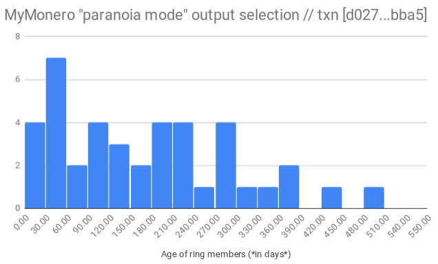

## About us
Noncesense Research Lab builds tools and analyses to study blockchain systems from an empirical data science perspective. Distributed consensus systems produce large amounts of canon data (e.g. number of transactions in a given block) along with oceans of ephemeral metadata - connection patterns, broadcast timestamps, data size, orphaned/alternative chains, etc. 

Noncesense seeks the signal in the noise - the anomalies, the edge cases, the subtle temporal and heuristic signatures. We curate a unique dataset, that enables endless new types of analyses. Data, tools, and analyses are disseminated as free and open source software / articles. While Monero is our most common use/test case, the vast majority of the analyses are directly conceptually transferrable to other blockchain projects.

## Contact / Invitation  
Much of our R & D discussions occur in [#noncesense-research-lab](https://www.irccloud.com/invite?channel=%23noncesense-research-lab&hostname=chat.freenode.net&port=6697&ssl=1) on Freenode IRC. Please join us! Feel free to introduce yourself, or lurk and learn.

Sporadic communication occurs asynchronously, since our volunteer contributors are distributed across multiple continents. Many members use IRCcloud to continue receiving messages even when their devices are offline. 

## Code/Infrastructure Contributors 
*(alphabetical by handle)*
-  [Gingeropolous](https://github.com/gingeropolous)
-  [IsthmusCrypto](https://github.com/mitchellpkt)
-  [NeffMallon](https://github.com/neffmallon)
-  [NeptuneResearch](https://github.com/neptuneresearch)
-  [SerHack](https://github.com/serhack)

Special thanks to the many denizens of #monero-reserach-lab and #noncesense-research-lab that have shared their ideas, experience, and perspectives during fascinating discussions


## Selected Projects & Results
### Monero Archival Project 
The [Monero Archival Project](https://github.com/mitchellpkt/monero_archival_project) is a Noncesense endeavor devoted to retaining all blockchain data, including the "lost stories" in orphaned blocks and transactions. This is possible due to our unique data set collected by our [custom archival daemon](https://github.com/neptuneresearch/monerod-archive). Archival nodes run 24/7 on a global network of virtual private servers, capturing a comprehensive realtime view of both obvious and subtle network activity. A live interface ([repo](https://github.com/neptuneresearch/monero-archive-monitor)) interacts with the daemon database to provide real-time visualizations.

###  Miner-reported timestamps are "nonsense!"
A block's miner selects the value included as its timestamp, so the reported value does not always reflect reality. MAP's archival nodes keep track of the time of actual receipt, to study timestamp spoofing, along with network latency and topology. Interestingly, the nodes often receive blocks that are timestamped from the future. Investigation of this phenomenon led to the observation of "Merlin" blocks, where the timestamp in a block precedes the timestamp in the previous block (e.g. block [1607957](https://moneroexplorer.com/search?value=1607957) and block [1607958](https://moneroexplorer.com/search?value=1607958), with respective timestamps 1728h and 1723h). Approximately 2% of Monero blocks exhibit this odd behavior. Consider the implications of the tight distribution around -400 seconds, echoing the typical distribution.


### Selfish mining detection
Analyses of alternative chains and reorganization events, combined with node receipt timestamp metadata, enables detection of probable [selfish mining](https://arxiv.org/abs/1311.0243) or [stubborn mining](https://eprint.iacr.org/2015/796.pdf).

One such instance is described in MAP wiki article: [Selfish mining at 1636647](https://github.com/Mitchellpkt/monero_archival_project/wiki/Selfish-mining-at-1636647) 

### Custom ring composition spoils Monero fungibility
This [wiki article](https://github.com/Mitchellpkt/monero_archival_project/wiki/Custom-ring-composition-spoils-Monero-fungibility) documents how a series of Monero transactions can be traced by two known analyses (unusual ring size and churn timing). Furthermore, a new heuristic is discovered: identifying sets of transactions with non-standard decoy selection algorithms. These are the types of subtle signals that are ostensibly obfuscated, but statistically quite loud! Distinct failure modes are dissected, and source attribution is validated by experimental transactions.



### Fixed fee options (Bohr fees)
Custom fee options have the potential to damage privacy, and thus fungibility. Many of the [conceptual reasons for fixed ring sizes](https://github.com/monero-project/monero/issues/4229#issuecomment-415139034) transfer to the questions of fixed fee options. IsthmusCrypto proposes that the network enforces discrete specific options for fee levels. For example, the base fee `B` with units of XMR/kB could be calculated by the normal dynamic fee algorithm, and the sender can adjust the priority by preset multiples, e.g. from `{0.002, 0.25*X, 0.5*X, X, 2*X, 4*X, 8*X}`. This saves space in a transaction since the user can represent their selection with only a single alphanumeric character. There is no room for wallet software mistakes or poor design choices to exhibit different and thus detectable behavior.

### Node ecosystem observations 
*(upcoming, collaborators welcome)* Methods are being explored to track enumeration and uptime of Monero nodes, to study the variability and volatility charactistics over multiple timescales. We're also exploring methods for ascertaining adoption rates around software upgrades.

### IP bottlenecks - a subtle centralization 
Performed a small study of nodes doubled up on IP addresses. Checked peer lists and found duplicates. This is a subtle type of centralization - if 20% of our nodes/miners are showing up over a handful of ProtonVPN addresses, then another DoS on the VPN would have the side effect of knocking a disproportional number of machines off the network.	

### Stop by for lots more!
If you want to see what else we're thinking about, check out the [Monero Archival Project issues](https://github.com/Mitchellpkt/monero_archival_project/issues) and join our [IRC channel](https://www.irccloud.com/invite?channel=%23noncesense-research-lab&hostname=chat.freenode.net&port=6697&ssl=1)

## NRL reading corner - some classics, and some fresh
*(links to good papers, not all by us)*
-  [An Empirical Analysis of Traceability in the Monero Blockchain](https://arxiv.org/pdf/1704.04299.pdf) and the [response from the Monero community](https://getmonero.org/2018/03/29/response-to-an-empirical-analysis-of-traceability.html)
-  [New kids on the block: an analysis of modern blockchains](https://allquantor.at/blockchainbib/pdf/anderson2016new.pdf)
-  [Digging into Browser-based Crypto Mining](https://arxiv.org/pdf/1808.00811.pdf)
-  [Majority is not Enough: Bitcoin Mining is Vulnerable](https://arxiv.org/abs/1311.0243)
-  [Stubborn Mining: Generalizing Selfish Mining and Combining with an Eclipse Attack](https://eprint.iacr.org/2015/796.pdf)
-  [Opportunistic investigation of Monero miners during April 2018 network update](https://hackernoon.com/opportunistic-investigation-of-monero-miners-during-march-2018-network-update-cfd6ad8a027f) *(by IsthmusCrypto)*

## Donations
### Noncesense/MAP infrastructure costs
The global network of virtual private servers hosting custom archival daemons and research nodes is crucial for capturing a continuous, comprehensive, and representative view of the Monero ecosystem. These servers incur monthly costs around 60 - 100 EUR. The base MAP network nodes run 24/7/365, and additional temporary servers are spun up for specific experiments (and deleted when unneeded, to keep costs as low as possible). 

Noncesense Research Lab is a not-for-profit ad hoc collective of volunteers producing FOSS tools and analyses for general public use. Right now, all infrastructure costs are supported out-of-pocket by individual contributors, who would greatly appreciate additional support in bearing these expenses.

### Address
Donations to help keep the lights on can be sent to `48GtemxMdbdaSvjCqWA4sJY3L4QUwEpUs2Rka5Rpu8yz9Sg5wpjbHsBSUviz44prcgiPXpHxeaFjHYCq824VjLtM19HjWGv` 


### Transparency
View key: `e05d5d432b84acd628d5faf18291188315cd71ae0f9beef96c6a73667f4ba104`

This is currently an informal donation process. While (value of donations) < (cost of servers), all donations will be directed toward VPS expenses. In the event that donations exceed expenses, appropriate uses will be discussed in #Noncesense-Research-Lab. The archival nodes generate more data than we can effectively store currently, so storage space and pipelines are the next likely candidate. Chime in if you would like to make a donation toward a specific subproject/expense.

*Disclaimer: the donation wallet is currently managed by one individual, on the behalf of Noncesense Research Lab. As the lab or donations scale, a more formal solution will be implemented - for example, a multi-sig wallet or Monero FFS.*

## Secure contact
[noncesense-research-lab@protonmail.com](mailto:noncesense-research-lab@protonmail.com)

```
-----BEGIN PGP PUBLIC KEY BLOCK-----
Version: SKS 1.1.6
Comment: Hostname: pgp.mit.edu

mQENBFu4PRwBCACvLZgKkIkMdfEc6uXe0wjaGP+sfN9HQthNryju0JBCwnf+fycNirHlyK92
BUDXe1DN/3YzZkLEym1G3P2SWURYi9iCKFziXjOYOWjtklJO71LRqP5jWw+2p5rexbT9Eruz
MTFNudvtejV3d8JywtE99QerKvPhqc2NTMpZb0/nrHK3ZdknG7ledJ9KjEMGtpxhkMNQNwip
TKtLny9U0Q4V8VzQs5bZnxUe3ni7SEOTS/ZJXDoWpbmU1CDPI1Nz0PaMZwrvTtKeS8jhFU5C
JcG2JP0BJKp4CywIV1fG0qeE44bGS182Kjs8+BlEmVqRzvm1tUga9eTxynUmP4tbiWQ/ABEB
AAG0QE5vbmNlc2Vuc2UgUmVzZWFyY2ggTGFiIDxub25jZXNlbnNlLXJlc2VhcmNoLWxhYkBw
cm90b25tYWlsLmNvbT6JAU0EEwEKADgWIQRLucDzM2TYI5gLoelCB4/jDfULWAUCW7g9HAIb
AwULCQgHAgYVCgkICwIEFgIDAQIeAQIXgAAKCRBCB4/jDfULWNNiB/is6xVWTAi30jQQQmyI
rinBkg+NcbfWM/6uH0VeKXjR8h2PbjokSRNZ7/pwcFDxv/ONzWf2beo4/XJGEKQyixmB5aTN
x6Za9NgzfiuaIckOmlcFi5Zmh8Az49FuyCqp1WEOj8BJVw+OCoCEbeZBnseRMpwr+k4GrPjJ
VwMsCsE3gRq7Piu31Gzt3+FsSLmzZI56SF85v4BDY5X8RmazBF1rLTQk3+yHvDo8ZFQoEQJy
5TXUFCojryamzYL4P1kXmrPvM5xhl4ylD8ugRHjwbnXGS/9C0Gh2gz/57/c6a7tWZn4+1cXW
St799Oo9dzZZDApDAXXzdWZ/g0+3S90Ww6+5AQ0EW7g9HAEIALEGaXuCvC/NrDEh4PpVUeM1
2cWS3e9B9hcZuxIW/UEHBVQeb79FB1rpzK1XfbjJrqF6NdzIIW2jIZbD3B8qsAvz0BwI6ULm
dDcF+hRlWTmmWNhDDsGTKYzMJ9VjGl2z4Z4AQcQjxoWwtv7pcROsyBuD39VFWvvFy9ZYznlR
A03ERJtFahLYFRBfHH4Wyrs7LZMriuJQ7sq7qn8pXozcqN97+OGBRtb2qdK7b5rjCi48IBbG
1P8Fvp+kuzJM4xNFfXAu3aC3nCF7T6t4iicndYGn0MHRO+BcGnayWBIv06NcvPLODgOynjoG
+eXmfHsRm8xpHkT78aDXSGhT/8dM3MUAEQEAAYkBNgQYAQoAIBYhBEu5wPMzZNgjmAuh6UIH
j+MN9QtYBQJbuD0cAhsMAAoJEEIHj+MN9QtY1OEH/iEjFkSlLiv7KKvBz5kCLMTg85FaR6H9
QVKKHkpmzlX7z8/p3Z4fDCtiY6OzJIXiQKkBOZU7CIe3IwG3ewm4ByBJD9ia2Lx7HSRRYGUy
OSk9HrvAKTnemED8X/Jik6kZJJv6S6Z/QYJZwLWQ8v9ZXGewdk6ibJc4c//O2W4wq7Wi+Crp
FhgEr0IzlPh48AJFzJ3jH9VfBOlBja4vkNqmgkkS4RGtuL7bZsnTdd4fT8zuppI/8eym6zvc
dY0RRhFQAtbOOA1b06/qyFOFbbMPUKqIo3p43a27ImIq1gRz98wvyuNhS7BWtapGyaNizQQe
TpiJk8x1dt5H7SwgPIHFD5Q=
=+9Jj
-----END PGP PUBLIC KEY BLOCK-----
```
